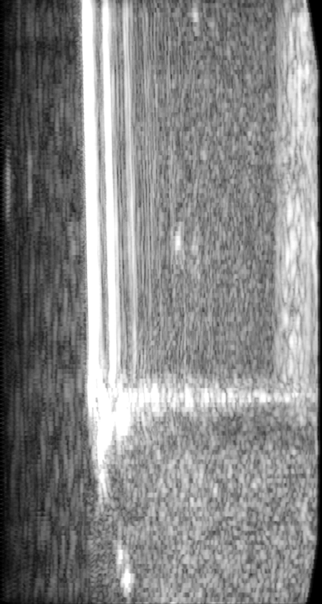

# 3D Ultrasound Reconstruction & Data Pipeline (ROS) Year: 2022

> **Project Context:** This repository contains the data engineering pipeline from a university robotics project. 
> **Goal:** Create a 3D volume reconstruction from a 2D ultrasound probe mounted on a robotic arm and meassure distance needle to blood vessel.
>
### Experimental Setup

### Ultrasonic Picture: Needle and Artifacts

### 3D Reconstruction Result
The final 3D volume reconstruction showing the needle (yellow) and the vessel (blue) used to measure the distance:

Initially the idea was to track the needle in realtime which was shown with Circular Hough Transforms

### 1. Live Needle Tracking
This recording shows the **Circular Hough Transform** tracking the needle cross section in real-time. The algorithm detects the needle tip as it moves through the phantom.

https://github.com/user-attachments/assets/5f6eab63-c814-4890-9b2d-d978f0cf3b92

### 2. Algorithm Robustness (Visualization)
A visualization of the parameter tuning. It demonstrates that the Hough Transform is strictly parameterized to detect only the specific diameter of the needle. Smaller circles (e.g., intersection artifacts or noise) are successfully ignored.

https://github.com/user-attachments/assets/ccd8009f-fc80-4099-b820-8b7d5e0c194c

## Tech Stack
* **Middleware:** ROS (Robot Operating System)
* **Languages:** Python (NumPy, SciPy)
* **Computer Vision:** OpenCV, Open3D
* **Data Formats:** `.npy` (Binary), ROS messages

## My Contributions

### 1. Data Ingestion & Synchronization (`CommunicationManager.py`)
This module handles the real-time data acquisition limitation where image and position data arrived asynchronously.
* Implemented a handshake mechanism via ROS topics (`/trigger_send_position`).
* Ensured **temporal alignment** of ultrasound images with the robotic arm's coordinate system.
* Serialized the synchronized datasets into binary NumPy files for efficient storage.

### 2. Data Processing & Segmentation (`ImageProcessor.py`)
Preprocessing of the noisy ultrasound raw data using computer vision techniques.
* **Noise Reduction:** Applied Gaussian blur and Sobel operators.
* **Segmentation:** Developed a custom ellipse-filter to detect needle cross-sections and vessels in the image data.
* **Optical Flow:** Experimented with Lucas-Kanade for motion tracking.

### 3. 3D Volume Reconstruction (`VolumeCreator.py`)
The core data product: converting 2D slices into a metric 3D point cloud.
* **Coordinate Transformation:** Mapped 2D pixel data to 3D table coordinates using the probe's physical dimensions.
* **Data Quality Filter:** Implemented logic to detect and discard scanlines with "jitter" or positional shifts (`filter_position_data`) to ensure a clean 3D model.
* **Visualization:** Generated Point Clouds using Open3D for distance measurements.

## Data Structure
The pipeline processes raw data stored as synchronized NumPy arrays:
* `_images.npy`: Array of 2D raw pixel data.
* `_positions.npy`: Corresponding x, y, z coordinates of the robotic effector.

This code is provided "as is" from the research prototype phase. Paths to local datasets (e.g., `D:\data`) are hardcoded and would be parameterized in a production environment

